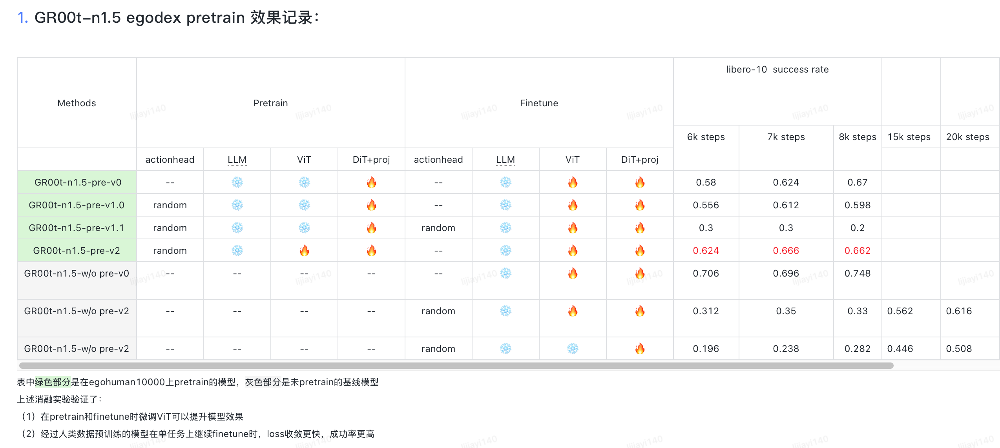
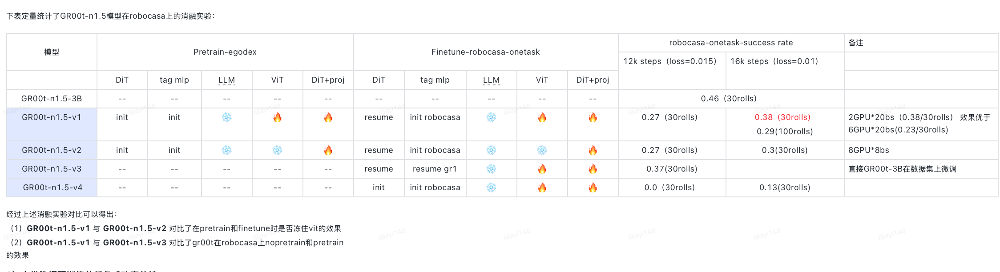
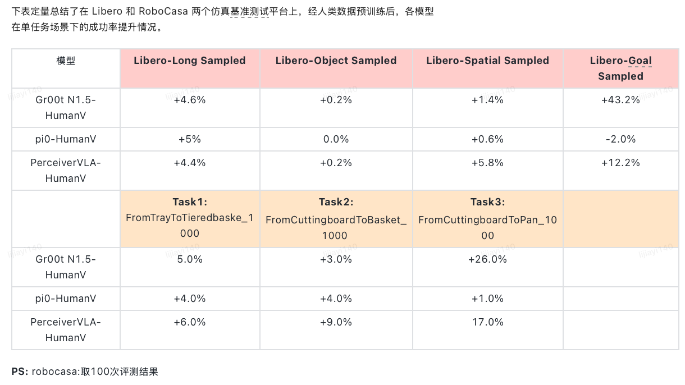

# GR00T-N15 VLA 

## 1. 仓库文档
- [数据格式说明](./asserts/1_Data.md)

- [模型训练与评测](./asserts/2_Train.md)

- [Bugs与环境等的记录](./asserts/3_Bugs.md)

- [训练与测试结果记录](./asserts/4_Exps.md)

- [gr00t-robocasa评测](./asserts/6_robocasa_train_eval.md)

- [gr00t-libero评测](./asserts/7_libero_train_eval.md)

- [gr00t-robotwin评测](./asserts/8_robotwin_train_eval.md)

##  2. 核心脚本文件
### 2.1 预训练文件脚本：
```bash
# 1. 多机多卡：
GR00T_QwenVLA
    ｜--pretrain_9_groot15_egohuman_fourier30w_tuneLLM.sh # egodex2fourier30w，预训练冻住ViT，tuneLLM+DiT

# 2. 单机多卡
GR00T_QwenVLA
    ｜--pretrain_7_groot15_use_egohuman_fourier.sh # egodex2fourier30w，预训练tuneVLM+DiT
```

### 2.2 后训练微调文件脚本：
```bash
# 1. 多机多卡：
GR00T_QwenVLA/
├── sft_robocasa_900ep_3task/
│   └── train_sh/
│       ├── sft_1_robocasa_nopretrain_finetuneALL_900ep_grootn15_eepose.sh  # 无预训练，全参微调900轮
│       └── sft_2_robocasa_pretrainALL6K_finetuneALL_900ep_grootn15_eepose.sh  # 预训练ALL6K后，全参微调900轮
└── sft_robotwin_150ep_3task/
    └── train_sh/  # RobotWin 3任务微调脚本（多机多卡）

# 2. 单机多卡
GR00T_QwenVLA/
├── sft_notebook_robocasa_1task_train/
│   └── train_sh/
│       ├── sft_robocasa_2_pretrainALL_finetuneALL_singletask_grootn15.sh  # RoboCasa单任务：预训练全参+后训练全参
│       └── sft_robocasa_2_mix_pretrainALL_finetuneALL_singletask_grootn15.sh  # RoboCasa单任务：预训练+人类数据混合微调
└── sft_robotwin_150ep_3task/
    └── train_sh/
        ├── sft_1_robotwin_nopretrain_finetuneALL_150ep_grootn15_eepose.sh  # RobotWin无预训练，全参微调150轮
        └── sft_2_robotwin_pretrainALL6K_finetuneALL_150ep_grootn15_eepose.sh  # RobotWin预训练ALL6K后，全参微调150轮
```

### 2.3 评测脚本：
    评测脚本查看 `gr00t-robocasa评测` & `gr00t-robotwin评测` 
 

## 3. gr00t-n15单任务消融实验
### 3.1 gr00t-n15在 libero-long 的单任务消融实验


### 3.2 gr00t-n15在 robocasa 的单任务消融实验


### 3.3 人类数据预训练单任务成功率总结


## 4. 人类数据预训练实验总结
 2025-11-1人类视频数据做预训练的结论利用人类视频作为不同模型的预训练数据，并且在夹爪和灵巧手的操作仿真环境下进行了验证，分析其实验结果，可得出如下结论：

- 人类视频数据作为预训练数据对模型性能整体上是有提升作用，尤其是在任务多样的仿真环境下。但是，有效程度会受到模型架构的影响。
- 对于 Gr00t 类型的模型架构，由于不同的本体有着单独编码器和解码器，不需要动作对齐，也能学习到其中的相通的物理规律知识，可以看出 Gr00t 的测试结果整体比较一致的。
- 对于 Pi0 类型的模型架构，没有针对不同本体的编码器和解码器，如果动作不对齐，学习到共性的知识较难。如果任务场景较为多样，人类视频数据仍能对模型训练提供一定的帮助。
- 针对某些固定场景的任务（LIBERO-Goal），由于人类视频数据与其分布不太一致，并且该场景也不需要太强的泛化能力，核心在于语言指令理解能力。因此，对于 Pi0 这种架构，人类视频数据起不到帮助作用。
- 针对 Pi0.5 的模型，人类视频未起作用，分析核心在于两个因素：人类视频的动作和状态未和下游任务场景对齐、状态作为语言 token 喂入模型，状态所起的作用被放大了。
- 人类视频数据作用的大小受到与微调场景的数据分布一致性的影响。
- 从 Libero 和 RoboCasa 两个不同的 Benchmark 来看，RoboCasa 的数据集分布相比于 Libero 与人类视频数据分布更接近，所以其提升效果也比在 Libero 仿真环境中高。

## 近期修改记录
- 2025-12-21 
  1. BUG修复：修复 “gr1_pos_transform.py 中的 IK/FK 历史状态冲突问题” : 在 GR1/RoboCasa 的 BodyRetargeter 中将 last_solution 改为按 env_idx 分桶保存（env_idx->chain_label->solution），并在 batch 循环调用 IK 时传入 env_idx，确保每个并行 env 的 IK 历史独立，避免互相覆盖。
  2. 功能上线：上线 RobotWin 多任务评测脚本。
  3. BUG修复：修复 “IK 的 retargeter（Robocasa 的 BodyRetargeter / Robotwin 的 AlohaRetargeter）会缓存上一帧/上一局的 IK 解作为 fallback，但在并行/串行 episode 切换时没有自动随 env reset 清理，导致新 episode 可能沿用旧 IK 历史的问题”： 采用在 env reset 的第一帧通过 obs 传递 meta.reset_mask（并行用数组、串行用标量），由 policy.py 接收后调用 retargeter 的 reset_ik_cache 清空对应 env_idx 的 IK bucket，从而避免跨 episode 串味。
- 2025-12-23
  1. BUG修复：修复了 robocasa中的random seed不固定的问题，传入seed固定住每个episode的env和obj的采样；补充了policy中flow matching的随机噪声固定操作
  2. 功能提交: 在pretrain时补充了eval loss的功能，提供一种可视化检查方法来判断模型的预训练效果。